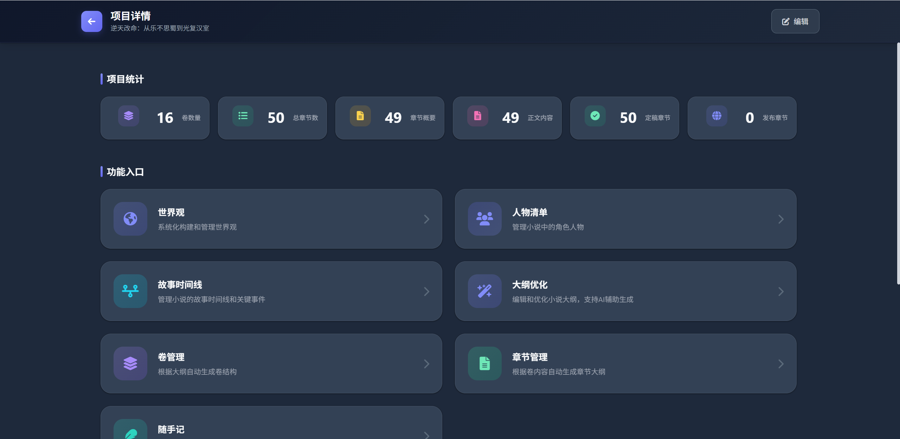
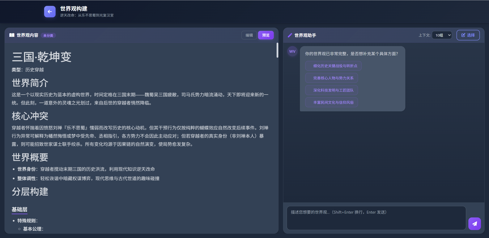
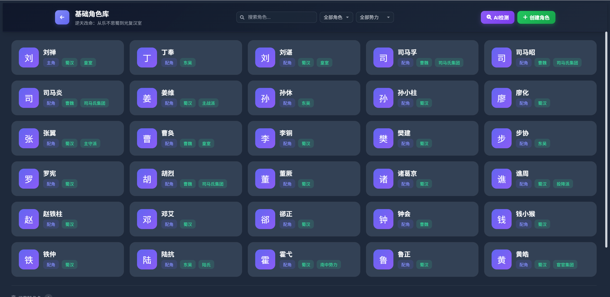
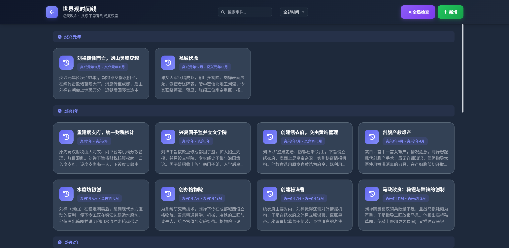
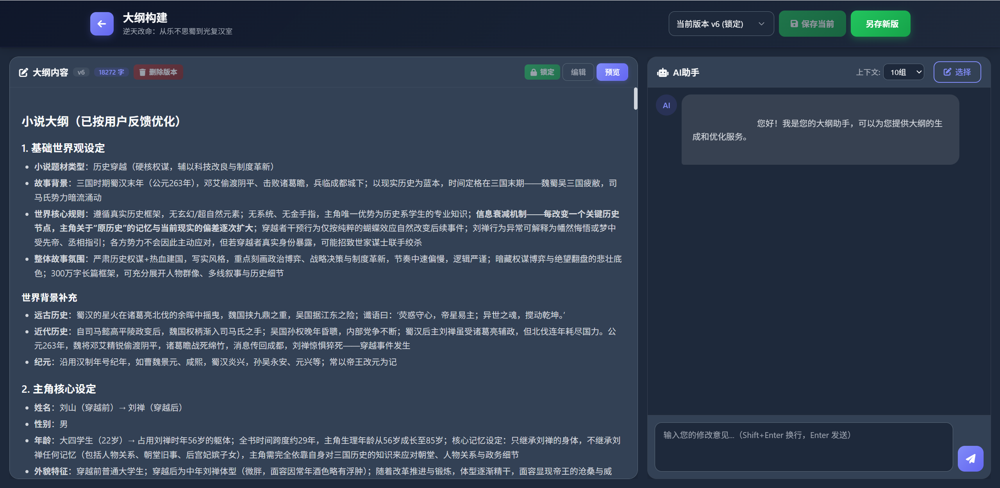
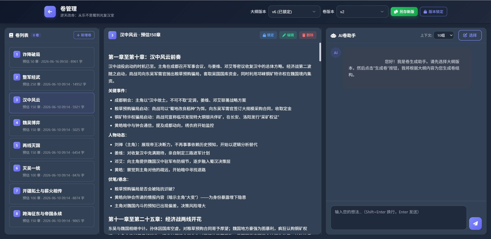
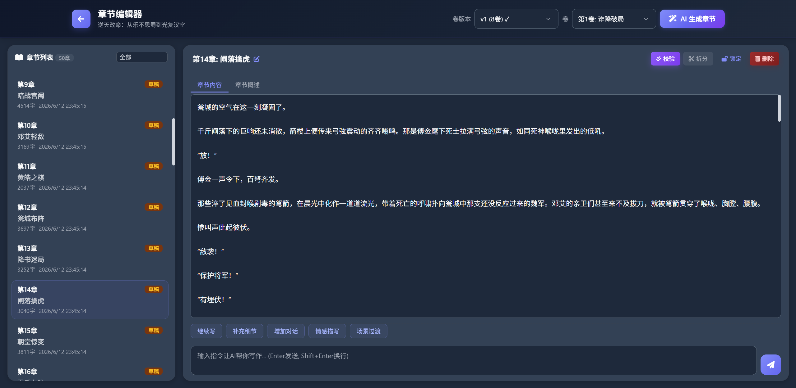
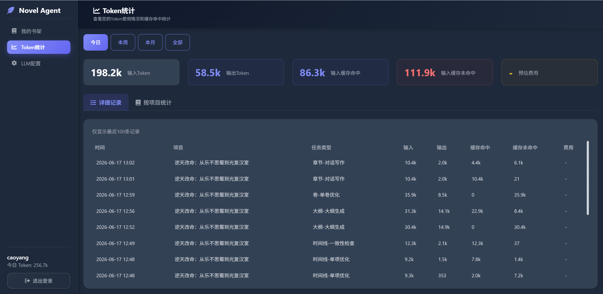

# Novel Agent - 智能小说创作助手

一个基于 Django 5.2 和 LLM 的智能小说创作辅助工具，帮助作者高效完成从世界观构建到章节内容生成的完整创作流程。

## 创作工作流

```
创建项目 → 世界观构建 → 人物清单 → 时间线 → 大纲构建 → 生成卷 → 生成章节
```

## 功能展示

### 项目主页


### 世界观（可聊天构建，也可表格填写）


### 人物清单


### 时间线管理


### 大纲优化


### 卷管理


### 章节管理


### Token 统计


## 功能特性

### 创作前准备

1. **用户认证系统** - 支持注册、登录、密码重置、JWT 认证，多用户独立管理项目
2. **项目创建** - 创建小说项目，填写名称和简介，支持 AI 协助生成标题和简介
3. **LLM 配置管理** - 支持多种 LLM 提供商（OpenAI、Anthropic、DeepSeek、通义千问、Ollama 等），不同创作任务可配置不同模型参数
4. **Token 用量统计** - 记录和统计 LLM 调用 Token 消耗

### 创作核心流程

5. **世界观构建** - 结构化世界观设定工具，涵盖基础设定、世界基础、力量体系、种族族群、社会结构、文化人文、历史进程、特殊规则等 8 个维度。支持分层 AI 生成、深度追问完善、一致性校验和冲突自动修复，可导出 Markdown
6. **人物角色管理** - AI 辅助生成角色设定，管理角色的外貌、性格、背景故事、核心动机、阵营等信息，支持 AI 润色优化
7. **时间线管理** - 管理故事时间线事件，支持按章节范围标记事件，AI 生成、合并、拆分、润色事件描述
8. **大纲构建** - 聊天式交互界面，与 AI 对话迭代完善小说大纲，支持多版本管理和版本定稿，支持大纲扩展（世界观、设定体系、历史背景等分类）
9. **卷结构设计** - 基于大纲生成卷的结构和摘要，支持调整卷的数量和内容，支持版本管理
10. **章节概要生成** - 为每一卷生成详细的章节概要（流式输出）
11. **章节内容生成** - 批量生成章节内容，支持连续性参考上下文（流式输出）
12. **章节编辑增强** - 支持章节续写、拆分、校验、内容优化、AI 聊天协作写作

### 辅助工具

13. **随手记** - 创作过程中随时记录灵感，支持 AI 润色整理
14. **自我优化接口** - 预留自我优化/自我审阅功能接口

## 技术栈

- **后端**: Django 5.2 + Django REST Framework
- **数据库**: MySQL 8.0+
- **缓存**: Redis
- **向量库**: Milvus（支持 Lite 嵌入式 / Standalone 两种模式）
- **Embedding**: DeepSeek API / 本地 sentence-transformers（可切换）
- **AI**: LangChain + OpenAI-compatible LLM API（默认 DeepSeek）
- **前端**: 原生 HTML / CSS / JavaScript（分离式文件结构，无构建工具）
- **流式输出**: Server-Sent Events (SSE)
- **认证**: JWT（djangorestframework-simplejwt）
- **日志**: Loguru

## 项目结构

```
novel-agent/
├── .env                          # 环境配置（从 .env.example 复制并修改）
├── .env.example                  # 环境配置模板
├── requirements.txt              # Python 依赖
├── manage.py                     # Django 管理脚本
├── Dockerfile                    # Django 容器镜像
├── docker-compose.yml            # 一键部署（Nginx + Django + MySQL + Milvus + Embedding）
├── docs/                         # 文档资源
│   └── images/                   # README 截图
├── docker/                       # Docker 配置
│   ├── entrypoint.sh             # 容器启动脚本（迁移 + collectstatic + Gunicorn）
│   ├── nginx/default.conf        # Nginx 反向代理（静态文件 + SSE 支持）
│   ├── mysql/init.sql            # MySQL 初始化
│   └── embedding/                # 独立 Embedding 服务（FastAPI + sentence-transformers）
│       ├── Dockerfile
│       └── server.py
├── novel_agent/                  # 项目配置目录
│   ├── settings.py               # Django 配置（含 Milvus/Embedding/STATIC_ROOT）
│   ├── urls.py                   # 主路由
│   ├── wsgi.py / asgi.py
│   ├── middleware.py             # JWT 认证中间件
│   ├── authentication.py        # 自定义 JWT 认证
│   └── utils.py                  # 项目级工具函数
├── agent/                        # LLM 调用封装
│   ├── llm.py                    # LLM 类（ChatOpenAI 封装）
│   ├── llm_scenes.py             # 场景化配置（温度/max_tokens）
│   └── memory.py                 # 消息历史滚动压缩
├── apps/
│   ├── knowledge/                # 向量知识库
│   │   ├── client.py             # Milvus 连接管理（local 嵌入式 / docker 独立服务）
│   │   ├── embedder.py           # Embedding 工厂（DeepSeek API / 本地模型）
│   │   ├── indexer.py            # 索引同步器（大纲/世界观/角色/卷/章节段落）
│   │   ├── retriever.py          # 检索器（include/exclude + 语义检索 + DB 降级）
│   │   ├── signals.py            # Django Signals 自动同步索引
│   │   └── management/commands/rebuild_knowledge.py  # 全量重建命令
│   ├── user/                     # 用户认证 & LLM 配置 & Token 统计
│   │   ├── models.py             # User, LLMConfig, UserLLMConfig, TokenUsageLog
│   │   ├── views.py              # 登录/注册/重置密码/Token 用量/LLM 配置页面
│   │   └── urls.py
│   ├── project/                  # 项目管理
│   │   ├── models.py             # ProjectList, Character, Worldview, WorldviewChatHistory
│   │   ├── views.py              # 项目列表/创建/详情页面
│   │   ├── base.py               # API 基础类（鉴权、项目上下文、知识库检索）
│   │   ├── prompts.py            # 项目相关提示词
│   │   └── urls.py
│   ├── worldview/                # 世界观构建
│   │   ├── models.py             # WorldView, WorldViewChatHistory
│   │   ├── views.py              # 多维度世界观设定/AI 生成/深度追问/一致性校验
│   │   ├── prompts.py            # 世界观生成提示词
│   │   ├── utils.py              # 世界观工具函数
│   │   └── urls.py
│   ├── characters/               # 人物角色管理
│   │   ├── models.py             # Character
│   │   ├── views.py              # 角色列表/详情/AI 生成/润色
│   │   ├── prompts.py            # 角色生成提示词
│   │   ├── serializers.py        # 角色序列化器
│   │   ├── constants.py          # 角色常量定义
│   │   └── urls.py
│   ├── timeline/                 # 时间线管理
│   │   ├── models.py             # TimelineEvent, TimelineChatHistory
│   │   ├── views.py              # 时间线事件/AI 生成/合并/拆分
│   │   ├── prompts.py            # 时间线提示词
│   │   ├── serializers.py        # 时间线序列化器
│   │   └── urls.py
│   ├── outline/                  # 大纲构建
│   │   ├── models.py             # OutlineVersion, OutlineChatHistory, OutlineExpansion
│   │   ├── views.py              # 大纲聊天/版本管理（流式 SSE）
│   │   ├── prompts.py            # 大纲构建提示词
│   │   └── urls.py
│   ├── volume/                   # 卷结构设计
│   │   ├── models.py             # VolumeVersion, VolumeList
│   │   ├── views.py              # 卷生成/版本管理
│   │   ├── prompts.py            # 卷生成提示词
│   │   ├── serializers.py        # 卷序列化器
│   │   └── urls.py
│   ├── chapter/                  # 章节管理
│   │   ├── models.py             # ChapterVersion, ChapterList
│   │   ├── views.py              # 章节概要/内容生成（流式 SSE）/续写/拆分/校验
│   │   ├── prompts.py            # 章节生成提示词
│   │   └── urls.py
│   └── note/                     # 随手记
│       ├── models.py             # Note
│       ├── views.py              # 笔记管理/AI 润色
│       ├── prompts.py            # 笔记润色提示词
│       └── urls.py
├── utils/                        # 全局工具
│   ├── constants.py              # 全局常量
│   ├── exceptions.py             # 自定义异常 & DRF 异常处理
│   └── helpers.py                # 通用辅助函数
├── templates/                    # 页面模板（HTML）
│   ├── login.html / register.html / reset_password.html
│   ├── project.html / index.html
│   ├── worldview.html / worldview_chat.html
│   ├── character.html / _character_fields.html
│   ├── timeline.html
│   ├── outline.html
│   ├── volume.html
│   ├── chapter.html
│   ├── note.html
│   ├── llm_config.html
│   └── token.html
└── static/                       # 静态文件（CSS / JS 分离）
    ├── css/
    │   ├── common.css            # 全局公共样式（暗色主题变量、布局、组件）
    │   ├── layout.css            # 页面布局框架
    │   ├── login.css / register.css
    │   ├── project.css / index.css
    │   ├── worldview.css / worldview_chat.css
    │   ├── characters.css
    │   ├── timeline.css
    │   ├── outline.css
    │   ├── volume.css
    │   ├── chapter.css
    │   ├── note.css
    │   ├── llm_config.css
    │   └── token.css
    └── js/
        ├── common.js             # 全局公共脚本（API 封装、认证、SSE、UI 工具）
        ├── login.js / register.js
        ├── project.js / index.js
        ├── worldview.js / worldview_chat.js
        ├── characters.js
        ├── timeline.js
        ├── outline.js
        ├── volume.js
        ├── chapter.js
        ├── note.js
        ├── llm_config.js
        └── token.js
```

## 安装和配置

### 1. 环境要求

- Python 3.10+
- MySQL 8.0+
- Redis
- Milvus（本地开发可选，使用嵌入式 Lite 模式无需额外安装；Docker 部署自动配置）

### 2. 复制环境配置模板

```bash
cp .env.example .env
```

### 3. 安装依赖

```bash
pip install -r requirements.txt
```

### 4. 配置环境变量

编辑 `.env` 文件，根据实际情况配置。完整字段说明见 `.env.example`，核心配置如下：

```env
# 数据库
MYSQL_DB_HOST=localhost
MYSQL_DB_PORT=3306
MYSQL_DB_DATABASE=novel_agent
MYSQL_DB_USER=root
MYSQL_DB_PASSWORD=your_password

# Redis
REDIS_DB_HOST=localhost
REDIS_DB_PORT=6379
REDIS_DB_PASSWORD=
REDIS_DB_DB=0

# LLM（DeepSeek）
LLM_API_KEY=your_api_key
LLM_MODEL=deepseek-chat
LLM_BASE_URL=https://api.deepseek.com

# Embedding（向量化，默认用 DeepSeek API 零配置启动）
EMBEDDING_PROVIDER=deepseek

# Milvus 向量库（默认用嵌入式，无需单独部署）
MILVUS_MODE=local
```

### 5. 初始化知识库索引（可选，首次使用）

```bash
python manage.py rebuild_knowledge --all
```

### 6. 数据库迁移

```bash
python manage.py makemigrations
python manage.py migrate
```

### 7. 创建超级用户

```bash
python manage.py createsuperuser
```

### 8. 运行开发服务器

```bash
python manage.py runserver
```

访问 http://127.0.0.1:8000/ 开始使用。

### 9. Docker 一键部署

```bash
# 1. 配置环境变量（调整 host 为 docker 服务名）
cp .env.example .env
# 修改 .env 中以下字段：
#   MYSQL_DB_HOST=mysql
#   REDIS_DB_HOST=redis
#   MILVUS_MODE=docker
#   MILVUS_HOST=milvus
#   EMBEDDING_PROVIDER=local
#   LOCAL_EMBEDDING_URL=http://embedding:8000/embed

# 2. 启动所有服务
docker-compose up -d

# 3. 初始化知识库
docker-compose exec django python manage.py rebuild_knowledge --all
```

Docker 部署包含的服务：

| 服务 | 说明 |
|------|------|
| nginx | 反向代理 + 静态文件服务（端口 80） |
| django | Gunicorn + UvicornWorker（4 workers，支持 SSE） |
| mysql | MySQL 8.0（端口 3306） |
| embedding | sentence-transformers 本地模型（端口 8080） |
| milvus | Milvus Standalone（端口 19530） |
| etcd | Milvus 依赖 |
| minio | Milvus 依赖 |

> **静态文件处理**: Docker 部署时，Django 容器启动会自动执行 `collectstatic`，将静态文件收集到 `STATIC_ROOT`（/app/staticfiles/），通过共享卷挂载到 Nginx 容器，由 Nginx 直接服务静态文件，Django 不再处理静态文件请求。

## 使用说明

### 1. 用户注册与登录

首次使用需注册账号，登录后可创建和管理多个小说项目。

### 2. 创建项目

登录后点击"新建项目"，填写小说名称和简介，也可让 AI 协助生成标题和简介。

### 3. 世界观构建

进入项目后，首先构建故事的世界观。结构化设定涵盖 8 个维度：
- **基础设定** - 世界名称、类型、风格定位
- **世界基础** - 地理、历法、自然规则、平衡机制
- **力量体系** - 能量类型、等级体系、宝物、灵兽
- **种族族群** - 种族分类、特征、关系
- **社会结构** - 朝廷、宗门、阵营、阶层、货币
- **文化人文** - 习俗、语言、日常生活、宗教信仰
- **历史进程** - 远古、近代、危机、命运
- **特殊规则** - 禁忌、秘密、轮回、穿越、系统

支持分层 AI 生成、深度追问完善、一致性校验和冲突自动修复。

### 4. 人物角色管理

AI 辅助生成角色设定，管理角色的：
- 角色类型（主角/配角/反派/路人）
- 外貌特征、性格特点、背景故事
- 核心动机、势力/阵营归属

支持 AI 润色优化角色描述。

### 5. 时间线管理

管理故事的时间线事件，按章节范围标记事件的发生区间。支持 AI 生成事件、合并/拆分事件、AI 辅助润色事件描述，梳理故事脉络。

### 6. 构建大纲

通过聊天式界面与 AI 交互，逐步完善小说大纲。支持多版本管理，可随时保存、加载、定稿不同版本的大纲。支持大纲扩展功能，可将世界观、设定体系、历史背景等详细记录纳入大纲管理。

### 7. 设计卷结构

大纲定稿后，设置卷的数量，让 AI 自动生成各卷的标题和摘要。支持与 AI 对话调整卷结构，支持版本管理。

### 8. 生成章节概要

进入某一卷，让 AI 为该卷生成详细的章节概要（流式输出）。

### 9. 生成章节内容

支持单章生成或批量生成，流式输出实时展示生成进度。批量生成时自动参考上一章内容保持连续性。支持章节续写、拆分、内容优化和 AI 聊天协作写作。

### 10. 随手记

创作过程中随时记录灵感，支持 AI 润色整理，系统化管理创作笔记。

### 11. LLM 配置管理

支持多种 LLM 提供商和模型。不同创作任务（世界观、角色、大纲、卷、章节、内容）可配置不同模型和参数，灵活适配各环节需求。

## 数据模型

### ProjectList（项目）
- `user` - 所属用户
- `title` - 小说名称
- `description` - 小说简介
- `status` - 状态（draft）
- `finalized` - 是否定稿
- `created_at` / `updated_at` - 时间戳

### WorldView（世界观）
- `project` - 关联项目
- `setting` - 基础设定（JSON）
- `foundation` - 世界基础（JSON）
- `power` - 力量体系（JSON）
- `races` - 种族族群（JSON）
- `society` - 社会结构（JSON）
- `culture` - 文化人文（JSON）
- `history` - 历史进程（JSON）
- `special` - 特殊规则（JSON）

### WorldViewChatHistory（世界观聊天历史）
- `worldview` - 关联世界观
- `role` - 角色（user/assistant）
- `content` - 内容
- `is_deleted` - 是否删除

### Character（人物角色）
- `project` - 关联项目
- `name` - 姓名
- `role_type` - 角色类型（主角/配角/反派/路人）
- `gender` - 性别
- `appearance` - 外貌特征
- `personality` - 性格特点
- `backstory` - 背景故事
- `motivation` - 核心动机
- `faction` - 势力/阵营

### TimelineEvent（时间线事件）
- `project` - 关联项目
- `title` - 事件标题
- `description` - 事件描述
- `era_unit` - 纪元单位
- `start_year` / `start_month` - 起始时间
- `end_year` / `end_month` - 结束时间
- `time_order` - 时序排序
- `is_deleted` - 是否删除

### TimelineChatHistory（时间线聊天历史）
- `project` - 关联项目
- `role` - 角色（user/assistant）
- `content` - 内容

### OutlineVersion（大纲版本）
- `project` - 关联项目
- `version_number` - 版本号（0 表示构建中版本）
- `content` - 大纲内容
- `is_finalized` - 是否定稿
- `is_current` - 是否为当前版本
- `is_deleted` - 是否删除
- `is_locked` - 是否锁定
- `snapshot` - 内容快照

### OutlineChatHistory（大纲聊天历史）
- `outline_version` - 关联大纲版本
- `role` - 角色（user/assistant）
- `content` - 内容
- `is_deleted` - 是否删除

### OutlineExpansion（大纲扩展）
- `outline_version` - 关联大纲版本
- `category` - 扩展分类（世界观/设定体系/历史背景/文化风俗/地点场景/规则设定/情节伏笔）
- `key_name` - 关键词
- `content` - 扩展内容

### VolumeVersion（卷版本）
- `project` - 关联项目
- `outline_version` - 关联大纲版本
- `version_number` - 版本号
- `is_finalized` - 是否定稿
- `is_current` - 是否为当前版本
- `is_deleted` - 是否删除
- `is_locked` - 是否锁定

### VolumeList（卷）
- `volume_version` - 关联卷版本
- `volume_number` - 卷号
- `title` - 卷标题
- `summary` - 卷摘要
- `chapters` - 章节列表（JSON）
- `content` - 卷大纲内容
- `chapter_count` - 预估章节数
- `is_locked` - 是否锁定

### ChapterVersion（章节版本）
- `volume` - 关联卷
- `version_number` - 版本号
- `is_finalized` - 是否定稿
- `is_current` - 是否为当前版本
- `is_deleted` - 是否删除

### ChapterList（章节）
- `chapter_version` - 关联章节版本
- `chapter_number` - 章节号
- `title` - 章节标题
- `summary` - 章节摘要
- `content` - 章节内容
- `status` - 状态（draft/published/archived）
- `word_count` - 字数
- `is_locked` - 是否锁定

### Note（随手记）
- `user` - 用户
- `project` - 关联项目
- `content` - 笔记内容
- `status` - 状态（未使用/已使用/已发布）

### LLMConfig（LLM 配置）
- `user` - 用户
- `provider` - 提供商（OpenAI/Anthropic/DeepSeek/通义千问/Ollama 等）
- `model_name` - 模型名称
- `api_key` - API 密钥（Base64 编码存储）
- `base_url` - API 地址
- `max_tokens` / `temperature` - 模型参数

### UserLLMConfig（用户任务 LLM 配置）
- `user` - 用户
- `llm_config` - 关联 LLM 配置
- `task_type` - 任务类型（世界观/角色/大纲/卷/章节/内容/默认）
- `max_tokens` / `temperature` - 任务级参数覆盖

### TokenUsageLog（Token 使用日志）
- `user` - 用户
- `project` - 关联项目
- `llm_config` - 使用的 LLM 配置
- `model_name` - 模型名称
- `prompt_tokens` / `completion_tokens` / `total_tokens` - Token 数量
- `cost` - 费用
- `task_type` - 任务类型

## API 接口

> 所有资源型 API 统一使用 `/api/projects/<id>/xxx` 嵌套路径，表达资源归属关系。

### 认证相关
| 接口 | 方法 | 说明 |
|------|------|------|
| `/api/auth/user/` | GET | 获取当前用户信息 |
| `/api/auth/refresh/` | POST | 刷新 JWT Token |

### 项目相关
| 接口 | 方法 | 说明 |
|------|------|------|
| `/api/projects/` | GET | 项目列表 |
| `/api/projects/create/` | POST | 创建项目 |
| `/api/projects/<id>/` | GET/PUT/DELETE | 项目详情/更新/软删除 |
| `/api/projects/<id>/stats/` | GET | 项目统计 |
| `/api/projects/<id>/title/suggest/` | POST | AI 标题建议 |
| `/api/projects/<id>/description/suggest/` | POST | AI 描述建议 |
| `/api/projects/description-optimization/` | POST | AI 描述优化（无项目 ID，创建时使用） |
| `/api/projects/<id>/description-optimization/` | POST | AI 描述优化（关联项目） |

### 世界观相关
| 接口 | 方法 | 说明 |
|------|------|------|
| `/api/projects/<id>/worldviews/` | GET | 世界观数据（按项目获取） |
| `/api/projects/<id>/worldviews/<wid>/` | GET/PUT/DELETE | 世界观详情/更新/删除 |
| `/api/projects/<id>/worldviews/<wid>/setting/` | PUT/POST | 基础设定（PUT 保存 / POST AI 生成，流式 SSE） |
| `/api/projects/<id>/worldviews/<wid>/foundation/` | PUT/POST | 世界基础（PUT 保存 / POST AI 生成，流式 SSE） |
| `/api/projects/<id>/worldviews/<wid>/power/` | PUT/POST | 力量体系（PUT 保存 / POST AI 生成，流式 SSE） |
| `/api/projects/<id>/worldviews/<wid>/races/` | GET/PUT/POST | 种族设定（GET 获取 / PUT 保存 / POST AI 生成，流式 SSE） |
| `/api/projects/<id>/worldviews/<wid>/society/` | GET/PUT/POST | 社会结构（GET 获取 / PUT 保存 / POST AI 生成，流式 SSE） |
| `/api/projects/<id>/worldviews/<wid>/culture/` | GET/PUT/POST | 文化设定（GET 获取 / PUT 保存 / POST AI 生成，流式 SSE） |
| `/api/projects/<id>/worldviews/<wid>/history/` | GET/PUT/POST | 历史设定（GET 获取 / PUT 保存 / POST AI 生成，流式 SSE） |
| `/api/projects/<id>/worldviews/<wid>/special/` | GET/PUT/POST | 特殊设定（GET 获取 / PUT 保存 / POST AI 生成，流式 SSE） |
| `/api/projects/<id>/worldviews/<wid>/factions/generate/` | POST | AI 生成阵营 |
| `/api/projects/<id>/worldviews/<wid>/locations/generate/` | POST | AI 生成地点 |
| `/api/projects/<id>/worldviews/<wid>/relations/generate/` | POST | AI 生成关系 |
| `/api/projects/<id>/worldviews/<wid>/deepening/questions/` | POST | 深度追问问题 |
| `/api/projects/<id>/worldviews/<wid>/deepening/submit/` | POST | 提交追问回答 |
| `/api/projects/<id>/worldviews/<wid>/deepening/apply/` | POST | 应用追问结果 |
| `/api/projects/<id>/worldviews/<wid>/consistency/check/` | POST | 一致性校验 |
| `/api/projects/<id>/worldviews/<wid>/consistency/fix/` | POST | 自动修复冲突 |
| `/api/projects/<id>/worldviews/<wid>/export/markdown/` | GET | 导出 Markdown |
| `/api/projects/<id>/worldviews/<wid>/chat/stream/` | POST | 聊天式构建（流式 SSE） |
| `/api/projects/<id>/worldviews/<wid>/chat/open/` | POST | 打开世界观聊天 |

### 角色相关
| 接口 | 方法 | 说明 |
|------|------|------|
| `/api/projects/<id>/characters/` | GET/POST | 角色列表/创建 |
| `/api/projects/<id>/characters/<cid>/` | GET/PUT/DELETE | 角色详情/更新/软删除 |
| `/api/projects/<id>/characters/generate/` | POST | AI 生成角色（流式 SSE） |
| `/api/projects/<id>/characters/polish/` | POST | AI 润色角色（流式 SSE） |
| `/api/projects/<id>/characters/check/` | POST | 角色一致性检查（流式 SSE） |
| `/api/projects/<id>/characters/optimize/` | POST | AI 优化角色（流式 SSE） |
| `/api/projects/<id>/characters/optimize/save/` | POST | 保存优化结果 |

### 时间线相关
| 接口 | 方法 | 说明 |
|------|------|------|
| `/api/projects/<id>/timeline/events/` | GET/POST | 事件列表/创建 |
| `/api/projects/<id>/timeline/events/<eid>/` | GET/PUT/PATCH/DELETE | 事件详情/更新/删除 |
| `/api/projects/<id>/timeline/chat-generate/` | POST | 聊天式生成时间线（流式 SSE） |
| `/api/projects/<id>/timeline/generate/` | POST | AI 批量生成（流式 SSE） |
| `/api/projects/<id>/timeline/merge/` | POST | 合并事件 |
| `/api/projects/<id>/timeline/split/` | POST | 拆分事件 |
| `/api/projects/<id>/timeline/optimize-single/` | POST | AI 润色单事件（流式 SSE） |
| `/api/projects/<id>/timeline/generate-fields/` | POST | AI 生成事件字段（流式 SSE） |
| `/api/projects/<id>/timeline/check/` | POST | 一致性检查（流式 SSE） |
| `/api/projects/<id>/timeline/check/optimize/` | POST | 修复时序问题（流式 SSE） |

### 大纲相关
| 接口 | 方法 | 说明 |
|------|------|------|
| `/api/projects/<id>/outline/chat/` | POST | 聊天式构建大纲（流式 SSE） |
| `/api/projects/<id>/outline/versions/` | GET | 项目大纲版本列表 |
| `/api/projects/<id>/outline/versions/save/` | POST | 保存大纲版本 |
| `/api/projects/<id>/outline/versions/<vid>/load/` | GET | 加载大纲版本 |
| `/api/projects/<id>/outline/versions/<vid>/` | GET | 大纲版本详情 |
| `/api/projects/<id>/outline/versions/finalize/` | POST | 定稿大纲版本 |
| `/api/projects/<id>/outline/latest/` | GET | 最新大纲内容 |
| `/api/projects/<id>/outline/finalize/` | POST | 定稿大纲 |
| `/api/projects/<id>/outline/lock/` | POST | 锁定/解锁大纲 |
| `/api/projects/<id>/outline/delete/` | POST | 软删除大纲版本 |
| `/api/projects/<id>/outline/chat-history/delete/` | POST | 删除聊天历史 |

### 卷相关
| 接口 | 方法 | 说明 |
|------|------|------|
| `/api/projects/<id>/volume-versions/` | GET/POST | 卷版本列表 / AI 生成卷结构（流式 SSE） |
| `/api/projects/<id>/volume-versions/<vid>/` | GET/PUT/DELETE | 卷版本详情/保存/删除 |
| `/api/projects/<id>/volume-versions/<vid>/save/` | POST | 另存为新版本 |
| `/api/projects/<id>/volume-versions/<vid>/finalize/` | POST | 定稿/解锁卷版本 |
| `/api/projects/<id>/volume-versions/<vid>/optimize/` | POST | AI 优化卷结构（流式 SSE） |
| `/api/projects/<id>/volume-versions/<vid>/chat/` | POST | 卷对话调整（流式 SSE） |
| `/api/projects/<id>/volumes/<vid>/lock/` | PUT | 锁定/解锁单卷 |
| `/api/projects/<id>/volumes/<vid>/generate/` | POST | AI 生成单卷（流式 SSE） |
| `/api/projects/<id>/volumes/optimize/` | POST | AI 优化单卷（流式 SSE） |

### 章节相关
| 接口 | 方法 | 说明 |
|------|------|------|
| `/api/projects/<id>/chapters/generate/` | POST | AI 批量生成章节（流式 SSE） |
| `/api/projects/<id>/chapters/content/` | POST | 生成/续写章节内容（流式 SSE） |
| `/api/projects/<id>/chapters/verify/` | POST | 章节一致性验证（流式） |
| `/api/projects/<id>/chapters/verify-fix/` | POST | 修复验证问题（流式） |
| `/api/projects/<id>/chapters/split/` | POST | 拆分章节（流式） |
| `/api/projects/<id>/chapters/save/` | POST | 保存/新建章节 |
| `/api/projects/<id>/chapters/status/` | POST | 章节状态操作（发布/归档/锁定/删除/恢复） |
| `/api/projects/<id>/chapters/hard-delete/` | POST | 永久删除章节 |
| `/api/projects/<id>/chapters/reorder/` | POST | 重新排列章节序号 |
| `/api/projects/<id>/chapters/volume/<vid>/load/` | GET | 加载卷下章节列表 |
| `/api/projects/<id>/chapters/<cid>/` | GET | 章节详情 |
| `/api/projects/<id>/chapters/chat/` | POST | AI 聊天协作写作（流式 SSE） |

### 随手记相关
| 接口 | 方法 | 说明 |
|------|------|------|
| `/api/projects/<id>/notes/` | GET/POST | 笔记列表/创建 |
| `/api/projects/<id>/notes/<nid>/` | GET/PUT/DELETE | 笔记详情/更新/删除 |
| `/api/projects/<id>/notes/polish/` | POST | AI 润色笔记（流式 SSE） |

### Token 用量相关
| 接口 | 方法 | 说明 |
|------|------|------|
| `/api/token-usage/today/` | GET | 今日 Token 用量 |
| `/api/token-usage/stats/` | GET | Token 用量统计 |

### LLM 配置相关
| 接口 | 方法 | 说明 |
|------|------|------|
| `/api/llm-config/` | GET/POST | 获取/更新 LLM 配置 |

## 开发计划

- [x] 向量知识库（Milvus + Embedding，自动索引 + 语义检索 + 降级策略）
- [ ] 实现自我优化/自我审阅功能
- [ ] 添加更多的自定义选项
- [ ] 添加导出功能（Word/EPUB/PDF）
- [ ] 添加版本管理功能
- [ ] 添加协作功能
- [ ] 连续性检查
- [ ] 章节冲突检查
- [x] 独立LLM配置
- [ ] redis存储用户LLM配置(API key仅支持实时解密, 避免报错时日志中存储)
