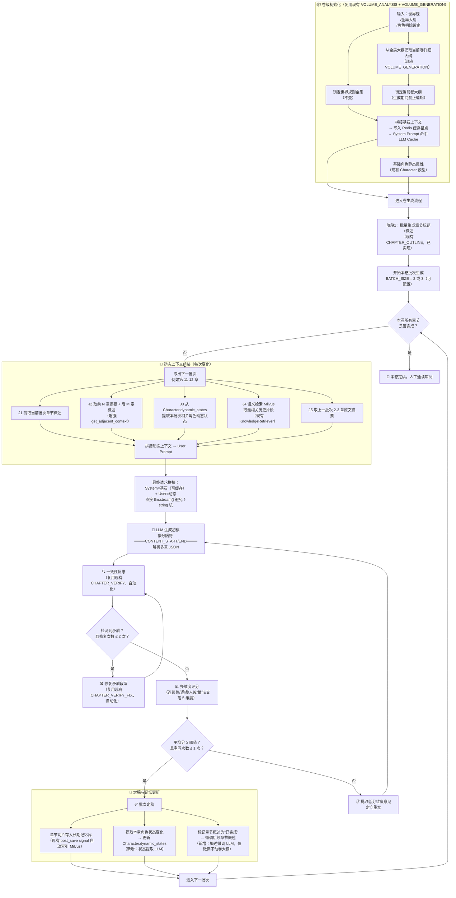

# 章节生成逻辑优化架构图

> 基于现有系统（卷分析 → 卷大纲 → 章节两阶段生成 + Milvus 知识库）的优化方案。
> 方案核心：卷级静态基石缓存锚点 + 批次化动态上下文组装 + 自动反思修复闭环 + 角色动态状态追踪。

## 方案与现有架构的映射关系

| 图中节点 | 现有实现 | 改造类型 | 代码位置 |
|---|---|---|---|
| B / C / D | 世界观、卷大纲生成 | 新增：生成期间写保护 + 缓存失效键 | `apps/volume/` |
| E 基石缓存锚点 | 无 | 新增：Redis cache + updated_at 版本键 | 新增到 `BaseAPIView` 或 `BaseChapterAPIView` |
| F 基础角色静态属性 | Character 模型 | 已有，仅新增 dynamic_states JSONField | `apps/characters/models.py` |
| G0 阶段1概述生成 | `ApiChapterGenerateView` Phase 1 | 已有，保持不变 | `apps/chapter/views.py#L120-L234` |
| K2 相邻章节上下文 | `get_adjacent_context()`（1前1后） | 增强：扩展为 N 前 M 后，可配置 | `apps/chapter/views.py#L54-L76` |
| K3 角色动态状态 | 无 | 新增：Character.dynamic_states 读取 + LLM 提取写入 | `apps/characters/models.py` + 新增 prompt |
| K4 语义检索历史 | `KnowledgeRetriever.retrieve(query_text=...)` | 已有，query 改成批次概述即可 | `apps/knowledge/retriever.py` |
| K5 上一批次原文 | `PREV_CHAPTER_TAIL_LENGTH`（1章末尾） | 增强：整批（2-3章）摘要拼接 | `apps/chapter/views.py` |
| O / Q 反思修复 | `ApiChapterVerifyView` + `VerifyFix` | 已有，改造为自动调用（最多2次循环） | `apps/chapter/views.py#L457-L580` |
| R / S / T 评分重写 | 无 | 新增：评分 prompt + 低分时定向重写（最多1次） | 新增到 `apps/chapter/prompts.py` |
| V 章节入记忆库 | `on_chapter_saved` signal → Milvus | 已有，自动运行无需改动 | `apps/knowledge/signals.py#L42-L51` |
| W 角色状态更新 | 无 | 新增：CharacterStateUpdatePrompt + 保存逻辑 | 新增模块 |
| X 后续概述微调 | 无 | 新增：概述微调 prompt（强约束不动核心节点） | 新增模块 |

## 落地三阶段（按 ROI 排序）

### 第一阶段：基石缓存 + 批次生成（改动最小，立即省成本）
- 实现 `E`（`get_cornerstone_context()` 缓存锚点）
- 改造 Phase 2 为 BATCH_SIZE=2 批次循环
- 增强 `K2`（前后章节扩展）和 `K5`（上一批摘要）
- 把世界观/角色移到 SYSTEM prompt，命中 LLM 厂商缓存 → 省 30-50% Token

### 第二阶段：角色动态状态 + 自动反思闭环（质量飞跃）
- 新增 Character `dynamic_states` JSONField（`F` + `K3` + `W`）
- `O→Q` 自动反思修复循环（最多 2 次，避免死循环）
- 章节定稿后自动调用状态提取 LLM，更新角色动态状态

### 第三阶段：评分系统 + 概述微调（锦上添花）
- 新增 5 维度评分 `R/S/T`（重写限 1 次，控成本）
- 后续章节概述微调 `X`（约束：不得变动卷大纲核心事件节点）
